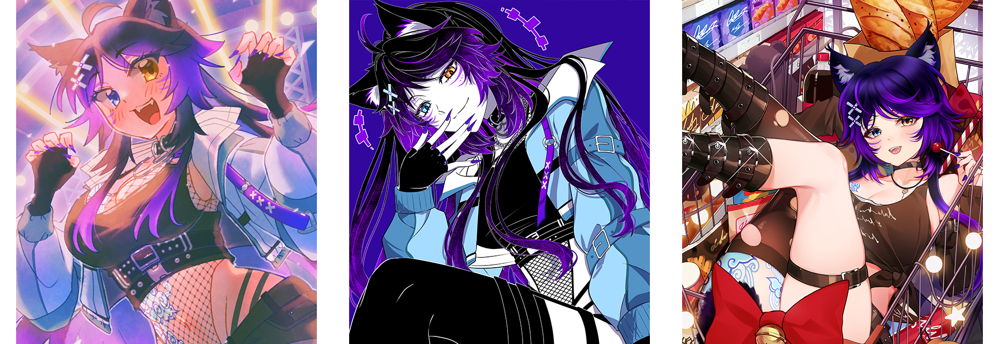

<div align="center">


# Hi, LynxJinx 🐾

<a href="https://github.com/DenverCoder1/readme-typing-svg">
  
</a>

</div>

## 🌟 whoami

<table align="center">
<tr>
<td width="50%" align="center" valign="middle">


</td>
<td width="50%" valign="middle">

```ts
const lynx = {
  name: "LynxJinx 🐾",
  role: "Founder & CEO @ Jinxxy · MyOshi · VBashi",
  world: "virtual reality, vtubers, avatars" +
         " & the virtual creator economy",
  codesIn: ["TypeScript", "a little PHP & C#"],
  vibe: "night-owl 🦉",
}
```

</td>
</tr>
<tr>
<td colspan="2" align="center" valign="middle">

</td>
</tr>
</table>

---

## 🛠️ What I'm Building

<table>
<tr>
<td width="50%" valign="top">

### [Jinxxy](https://jinxxy.com)
> *"A marketplace for the creators building the virtual world."*

The marketplace for virtual assets - VR & VTuber avatars, wearables & 3D goods.

[](https://jinxxy.com)

</td>
<td width="50%" valign="top">

### [MyOshi](https://myoshi.co)
> *"A retro social network for VTubers"*

A retro, social network for VTubers, avatar creators, and their fans:
code-customizable profiles, a Top 8, bulletins & forums.

[](https://myoshi.co)

</td>
</tr>
</table>

---

## ⚙️ Tech & Tools


---

## 📊 Dev stats

<div align="center">


</div>


<!--START_SECTION:waka-->


**I'm a Night 🦉** 

```text
🌞 Morning                15865 commits       ██░░░░░░░░░░░░░░░░░░░░░░░   07.71 % 
🌆 Daytime                36462 commits       ████░░░░░░░░░░░░░░░░░░░░░   17.72 % 
🌃 Evening                88846 commits       ███████████░░░░░░░░░░░░░░   43.19 % 
🌙 Night                  64547 commits       ████████░░░░░░░░░░░░░░░░░   31.38 % 
```
📅 **I'm Most Productive on Wednesday** 

```text
Monday                   34765 commits       ████░░░░░░░░░░░░░░░░░░░░░   16.90 % 
Tuesday                  39401 commits       █████░░░░░░░░░░░░░░░░░░░░   19.15 % 
Wednesday                42176 commits       █████░░░░░░░░░░░░░░░░░░░░   20.50 % 
Thursday                 39907 commits       █████░░░░░░░░░░░░░░░░░░░░   19.40 % 
Friday                   39020 commits       █████░░░░░░░░░░░░░░░░░░░░   18.97 % 
Saturday                 3791 commits        ░░░░░░░░░░░░░░░░░░░░░░░░░   01.84 % 
Sunday                   6660 commits        █░░░░░░░░░░░░░░░░░░░░░░░░   03.24 % 
```


📊 **This Week I Spent My Time On** 

```text
🕑︎ Time Zone: America/New_York

💬 Programming Languages: 
No Activity Tracked This Week

🔥 Editors: 
No Activity Tracked This Week
```

**I Mostly Code in TypeScript** 

```text
TypeScript               17 repos            ██████████████████░░░░░░░   73.91 % 
JavaScript               2 repos             ██░░░░░░░░░░░░░░░░░░░░░░░   08.70 % 
PHP                      1 repo              █░░░░░░░░░░░░░░░░░░░░░░░░   04.35 % 
C#                       1 repo              █░░░░░░░░░░░░░░░░░░░░░░░░   04.35 % 
MDX                      1 repo              █░░░░░░░░░░░░░░░░░░░░░░░░   04.35 % 
```


 Last Updated on 23/06/2026 08:13:11 UTC
<!--END_SECTION:waka-->


---

## 🔗 Connect

[](https://x.com/LynxJinxxy)
[](https://jinxxy.com)
[](https://myoshi.co)
[](mailto:lynx@jinxxy.com)

<sub>Top languages reflect repos I host on GitHub, not skill level - there's a lot I don't push here.</sub>
